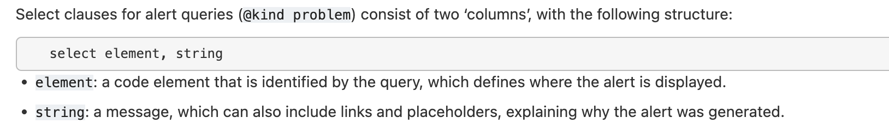

# java审计- Codeql速学笔记

基于网上开源的知识整理总结（见reference），没有特殊声明的都是参考官方doc编写的，遗漏之处欢迎补充。本篇只总结对自己有帮助/快速学习的部分，如果你和我一样需要快速学习（浅显）/速查，那么欢迎参考本篇:)

前置知识：

1. spring下的build和打包为.jar （最基本的前提 因为create要用mvn构建）
2. codeql cli/vscode插件配置
3. codeql create


## 基本概念

首先codeql的查询会有以下几种类型：

- Alert queries： 单个敏感点查询
- Path queires：
    - data-flow path
    - control-flow path
    

摘自：[https://www.freebuf.com/sectool/349705.html](https://mp.weixin.qq.com/s?__biz=MzkzNjMxNDM0Mg==&mid=2247485471&idx=1&sn=c879ac61f71d5d11ed20b7529606e110&chksm=c2a1dc96f5d655803c87c6b7601ede9ecadd59bc6d8a46cedbeb7eef13f64b7d1acdd0de4593&token=1303163217&lang=zh_CN#rd)

Flow 代表数据流，与此对应的概念包括source（用户输入点）和sink（危险函数）。
Type代表类型，是属于CodeQL中一个很重要的概念，Type类有俩个直接派生类PrimitiveType，RefType。

- PrimitiveType代表Java中的基础数据类型**，**派生类有boolean, byte, char, double, float, int, long, short, void,, null。
- RefType代表Java中的引用类型**，**有派生类Class、Interface、EnumType、Array。

### 查询结构

基本的结构如下。需要掌握的概念通过注释补充了出来👀 ：

```java
/**
 *来源：https://codeql.github.com/docs/writing-codeql-queries/about-codeql-queries/
 * Query metadata：提供有关查询的信息。初学不是重点关注，后续想为爱发电可以学学捏
 * 如果用 codeql cli，必须包括@kind
 */

import /* ... 导入库/模型 ｜ CodeQL libraries or modules ... */

/* ... Optional, define CodeQL classes and predicates ...
 *			       即：定义你自己的predicate和class（初学就“先”这么理解吧）
 */

from /* ... 变量声明 ｜ variable declarations ... */
where /* ... 逻辑语法（一些条件）｜ logical formula ... */
select /* ... 表达式 ｜expressions ... */
```

form：

格式必须是 `<type> <variable name>`，官方提供的可供参考的type参考：[https://codeql.github.com/docs/ql-language-reference/types/#types](https://codeql.github.com/docs/ql-language-reference/types/#types)

where：

对form提供的变量增加限制条件，使用到的概念有聚合([aggregations](https://codeql.github.com/docs/ql-language-reference/expressions/#aggregations))，谓词([predicates](https://codeql.github.com/docs/ql-language-reference/predicates/#predicates))和公式([formulas](https://codeql.github.com/docs/ql-language-reference/formulas/#formulas))

select：

where过滤后满足条件的子句，有效结构需要配合metadata的@kind。所以自己写/参考别人的时候，不同的select，所对应的metadata的@kind也有所区别。例如：



如果是污点查询从source到sink，则用的是*`@kind path-problem`  （***`select** sink.getNode(), source, sink, "<message>"`）

输出结果的展示可以参考：[https://codeql.github.com/docs/writing-codeql-queries/defining-the-results-of-a-query/](https://codeql.github.com/docs/writing-codeql-queries/defining-the-results-of-a-query/)

**predicate和class部分**：

predicate这里有[with result](https://codeql.github.com/docs/ql-language-reference/predicates/#predicates-with-result)和without result两种写法， with result的结构可以看超链接，知道是什么样子的。为了速用网上的一些参考和改写，这里先学without result的,如下：

```jsx
predicate <name>(<variable type>:<variable name>) {
}

```
这里的type例如Method,Name,Call....name则是例如from Method method后的method
这里predicate还会用到 `instanceof` 代表当前对象是后者的类型。predicate其实就是一些where下查询的封装。例如参考一个python的codeql案例：
```
import python

predicate isEvalCall(Call c, Name name) {
  c.getFunc() = name and
  name.getId() = "eval"
}

from Call c, Name name
where isEvalCall(c, name) and
  c.getLocation().getFile().getRelativePath().regexpMatch("2/challenge-1/.*")
select c, "call to 'eval'."
```
等同于
```

from Call c, Name name
where name.getId() = "eval" and
c.getFunc() = name and
c.getLocation().getFile().getRelativePath().regexpMatch("2/challenge-1/.*")
select c
```

class则可以参考freebuf下的[案例](https://www.freebuf.com/articles/web/283795.html) （后续的flow的写法均可参照这个框架）：

DataFlow::Node node 代表从sourc到sink的一个节点。具体看freebuf的那张图。

除了TaintTracking外，还可以看看SummaryModelCsv，SinkModelCsv，新人审计可能也会用到

```jsx
class VulConfig extends TaintTracking::Configuration {
 
   override predicate isSource(DataFlow::Node src) { 
			.....略.... }
 
   override predicate isSink(DataFlow::Node sink) {
			......略....
   }
 }
```

### where cheatsheet

速学指北怎么可以没有cheatsheet喵 欢迎补充

**注意： 在 `where`下，`=`并不意味着赋值， 而是判断**，即；
c.getFunc() = name 和 name = c.getFunc() 是同一个意思

```jsx

// 备注：非完整ql查询，这里只根据场景列where部分/where 片段
// 结合起来用的demo看参考来源文章：
// https://www.freebuf.com/sectool/349705.html
// https://github.com/Firebasky/CodeqlLearn

/* Class cheatsheet
* from Class c
*/
//查询全限定名中包含Person的类
where c.getQualifiedName().indexOf("Person") >=0
//使用getASupertype*()递归查找父类 字段类型继承java.lang.Throwable
where c.getASupertype*().hasQualifiedName("java.lang", "Throwable")
//同上 例子是查找inputStream类
c.getASupertype*().hasQualifiedName("java.io", "InputStream")

/* Field cheatsheet
* from Field f
*/
//获取字段对应的类型
//前置条件：where c.getASupertype*().hasQualifiedName("java.lang", "Throwable") and
f.getDeclaringType() = c
//获取修饰符为public的
f.getAModifier().getName() = "public"

/* 
* MethodAccess Method cheatsheet
* from MethodAccess call, Method method
*/
// toObject（）方法
where method.hasName("toObject")
// toObject()方法调用点
where method.hasName("toObject") and call.getMethod() = method
// 方法返回的类型是TypeString
where call.getQualifier().getType() instanceof TypeString


/* 
* DataFlow Cheatsheet
* where 查询污点流 {user-class}指自己extends TaintTracking::Configuration后起的名字
* from DataFlow config, DataFlow::PathNode source, DataFlow::PathNode sink
*/
//查询flow
// select则多半为select source.getNode(), source, sink, "source"
where config.hasFlowPath(source, sink)


/* Name / Call cheatsheet
* from Call c, Name name
*/
// 查询变量名叫“eval”
 where name.getId() = "eval" 

```
### zero to hero
强烈推荐这篇[CodeQL zero to hero](https://github.blog/2023-06-15-codeql-zero-to-hero-part-2-getting-started-with-codeql/)系列，有基本概念从2开始即可
> 挑战5: Run the query to show all function calls to functions named “eval.”    

(我去掉了正则匹配的部分)
```
from Call c, Name name
where name.getId() = "eval" and
    c.getFunc() = name
select c
```


### 常用到的query

案例1 `MethodAccess` 与 `instance of` 的实践

例如有以下的java code

```java
public class TestJava {
    void myJavaFun(Object o) {
        boolean b = o.equals("");
    }
}
```

这里， 输入的参数object的方法 `equals` 是继承下的方法。如果场景我们这里只是测string类型的话，就会误报（因为只有Object类本身没有equals方法）。消除误报的情况是用 `instanceof TypeString`  

```jsx
from MethodAccess ma
where
  ma.getQualifier().getType() instanceof TypeString and
  ma.getMethod().hasName("equals") and
  ma.getArgument(0).(StringLiteral).getValue() = ""
```

案例2: 查找java.io.FileReader对象调用点

基于官方改动了一点（官方给的我这边select会报错）

```jsx
/**
 * @id java/examples/vuldemo
 * @name Sql-Injection
 * @description Sql-Injection
 * @kind path-problem
 * @problem.severity warning
 */

import java

from Constructor fileReader, Call call 
where
  fileReader.getDeclaringType().hasQualifiedName("java.io", "FileReader") and
  call.getCallee() = fileReader // 限制构造函数类型为java.io.FileReader,且 调用fileReader构造函数的地方
select call.getArgument(), "FileReader"
```

如果输出并不是想要的，继续修改select处的语法, 我们可以根据callable类型的[官方文档](https://codeql.github.com/codeql-standard-libraries/csharp/semmle/code/csharp/Callable.qll/module.Callable.html)继续改写

~~学到这里的感触：啊啊啊啊啊怎么java需要学的这么多啊草~~

## 还原Lombok代码
[github](https://github.com/github/codeql/issues/4984)上的最新进度是已经可以支持lombok了。另外如果你是旧版，除了本文后参考的文章（如果遇到实际尝试会遇到java版本不支持的情况。）也可以试上述[github](https://github.com/github/codeql/issues/4984)上给出的解决方案，是用delombok。
但建议还是使用新版codeql !


## 更多的queries学习案例

codeql官方是给的很多example的，可以看：

- [https://codeql.github.com/codeql-query-help/java/](https://codeql.github.com/codeql-query-help/java/)
    - [https://github.com/github/codeql/blob/main/java/ql/src/experimental/Security/CWE/CWE-094/SpringViewManipulation.ql](https://github.com/github/codeql/blob/main/java/ql/src/experimental/Security/CWE/CWE-094/SpringViewManipulation.ql)

1. spel注入点检测

来源：[https://github.com/github/codeql/blob/main/java/ql/src/Security/CWE/CWE-094/SpelInjection.ql](https://github.com/github/codeql/blob/main/java/ql/src/Security/CWE/CWE-094/SpelInjection.ql)

```
import java
import semmle.code.java.security.SpelInjectionQuery
import semmle.code.java.dataflow.DataFlow
import SpelInjectionFlow::PathGraph

from SpelInjectionFlow::PathNode source, SpelInjectionFlow::PathNode sink
where SpelInjectionFlow::flowPath(source, sink)
select sink.getNode(), source, sink, "SpEL expression depends on a $@.", source.getNode(),
  "user-provided value"
```

参考官方提供的文档，关于查找非可信数据源：

```jsx
public Object evaluate(Socket socket) throws IOException {
  try (BufferedReader reader = new BufferedReader(
      new InputStreamReader(socket.getInputStream()))) {

    String string = reader.readLine();
    ExpressionParser parser = new SpelExpressionParser();
    Expression expression = parser.parseExpression(string);
    return expression.getValue();
  }
}
```

## 本项目未来todo
- 创建一个cheatsheet单独的文件

## Reference&Resource

- [https://codeql.github.com/docs/](https://codeql.github.com/docs/)
- [https://github.com/github/codeql/blob/main/java/ql/src/Security/CWE/CWE-094/SpelInjection.ql](https://github.com/github/codeql/blob/main/java/ql/src/Security/CWE/CWE-094/SpelInjection.ql)
- [https://www.freebuf.com/sectool/349705.html](https://www.freebuf.com/sectool/349705.html) （实战非靶场项目真的很推荐看这篇。例子是基于spring开发的若依的codeql审计）
- [https://github.com/Firebasky/CodeqlLearn](https://github.com/Firebasky/CodeqlLearn) 心得+列出了一些开箱即用的

推荐：

- 关于Lombok不支持ql查询的解决方法：[https://tttang.com/archive/1497/#toc__2](https://tttang.com/archive/1497/#toc__2)
- git上别人整理的学习资源：[https://github.com/safe6Sec/CodeqlNote](https://github.com/safe6Sec/CodeqlNote)